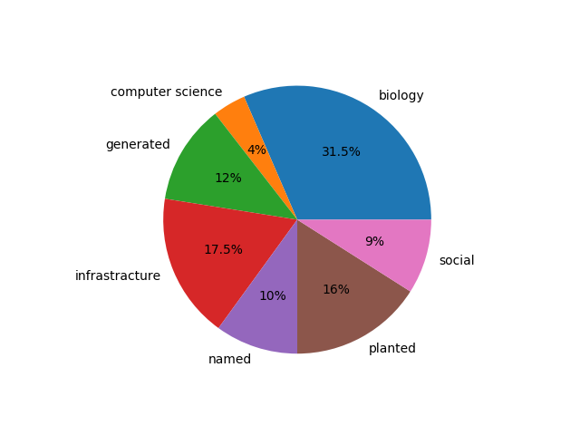
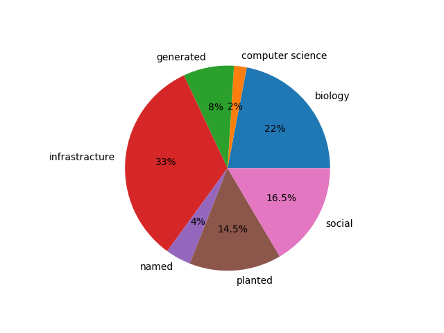

# PACE 2020 (Treedepth): Instances

This repository contains public and private instances used in [PACE 2020 challenge](https://pacechallenge.org/2020/). The set of instances contains graphs comming from various applications and generated using a few generators. They can be divided into the following categories:

- **biology** blah
- **computer science** blah

## Instances for Exact Track

The instances are in `exact` folder. See [descripion of all instances](exact.md) (the same information can be found in the `exact.csv` file).
The distribution of categories is as follows.

| domain | number of instances |
| --- | --- |
biology             | 63 | 
computer science    |  8 | 
generated           | 24 |
infrastracture      | 35 |
named               | 20 |
planted             | 32 |
social              | 18 |

## Instances for Heuristic Track

The instances are in `heur` folder. See [descripion of all instances](heur.md) (the same information can be found in the `heur.csv` file).
The distribution of categories is as follows.

| domain | number of instances |
| --- | --- |
biology             | 44 |
computer science    |  4 |
generated           | 16 |
infrastracture      | 66 |
named               |  8 |
planted             | 29 |
social              | 33 |

