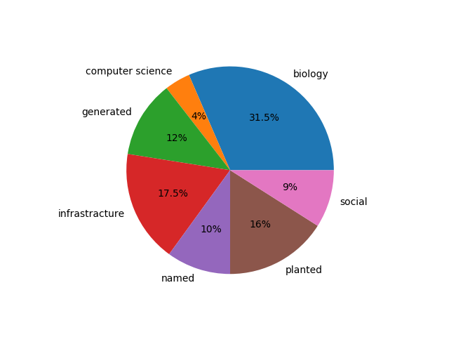
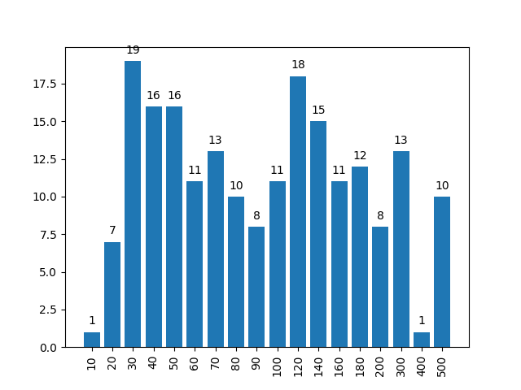
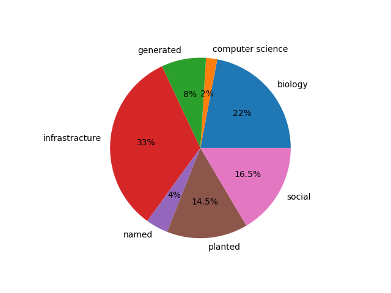
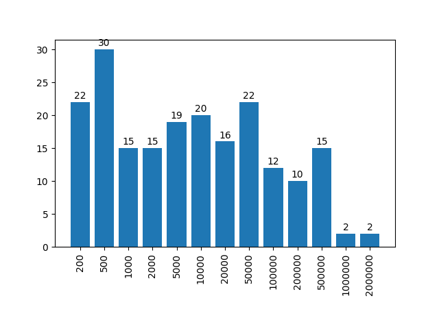

# PACE 2020 (Treedepth): Instances

This repository contains public and private instances used in [PACE 2020 challenge](https://pacechallenge.org/2020/). The set of instances contains graphs comming from various applications and generated using a few generators. They can be divided into the following categories:

- **biology:** Graphs coming from applications in biology, biochemistry and medicine. 
Downloaded from [BioGRID](https://thebiogrid.org/), [SNAP](http://snap.stanford.edu/biodata/), [ginsim.org](ginsim.org/models_repository), [KEGG](https://www.genome.jp/kegg/), [STRING](https://string-db.org/) and [network repository](http://networkrepository.com/chem.php)
- **computer science:** [Control-flow graphs](http://github.com/freetdi/CFGs) of C functions and graphs originating from register allocation for variables in real codes, created for [DIMACS Coloring Challenge 1992-1993](http://www.dimacs.rutgers.edu/archive/Challenges/). 
- **generated:** Graphs obtained from Python's networkx generators: expanders, grids, random cubic graphs, Waxman graphs (random geometric graphs)
- **infrastracture:** road graphs obtained from open street maps, power grid networks (from  [network repository](http://networkrepository.com/power.php), [public transport graphs](http://github.com/daajoe/transit_graphs) contributed by Johannes Fichte for PACE 2016 
- **named:** small named graphs like the Petersen graph, the flower snark, etc., originating from [SageMath](https://www.sagemath.org/).
- **planted:** random trees and cycles of cliques poluted with random edges that go bottom-up the optimal treedepth decomposition. These instances were needed for testing correctness of treedepth solvers, because the generator was able to compute the optimum treedepth in polynomial time.
- **social:** social networks originating from interations between people, animals, fiction characters.

If you use the collection please cite the report 
> Kowalik, Mucha, Nadara, Pilipczuk, Sorge, Wygocki *The PACE 2020 Parameterized Algorithms and Computational Experiments Challenge: Treedepth*, Proc. IPEC 2020, LIPICS (To appear).

## Instances for Exact Track

The instances are in `exact` folder. See [descripion of all instances](exact.md) (the same information can be found in the `exact.csv` file).
The distribution of categories is as follows.

| domain | number of instances |
| --- | --- |
biology             | 63 | 
computer science    |  8 | 
generated           | 24 |
infrastracture      | 35 |
named               | 20 |
planted             | 32 |
social              | 18 |

There are 200 benchmark instances, labeled exact001.gr to exact200.gr. The instances are ordered lexicographically by non-decreasing (n,m) where n is the number of vertices and m is the number of edges. Graphs exact001.gr - exact176.gr have from 10 to 200 vertices and graphs exact177.gr - exact200.gr have from 201 to 500 vertices (see the histogram below).

## Instances for Heuristic Track

The instances are in `heur` folder. See [descripion of all instances](heur.md) (the same information can be found in the `heur.csv` file).
The distribution of categories is as follows.

| domain | number of instances |
| --- | --- |
biology             | 44 |
computer science    |  4 |
generated           | 16 |
infrastracture      | 66 |
named               |  8 |
planted             | 29 |
social              | 33 |

There are 200 benchmark instances, labeled heur001.gr to heur200.gr. The instances are ordered lexicographically by non-decreasing (n,m) where n is the number of vertices and m is the number of edges. The number of vertices is between 100 and 2,000,000 (see the histogram below) and the number of edges does not exceed 3,000,000.

